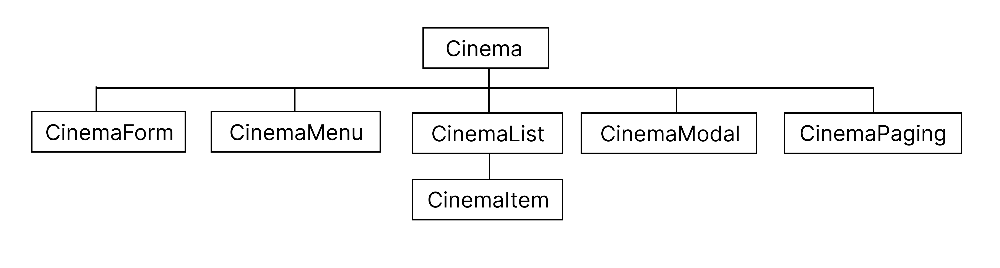
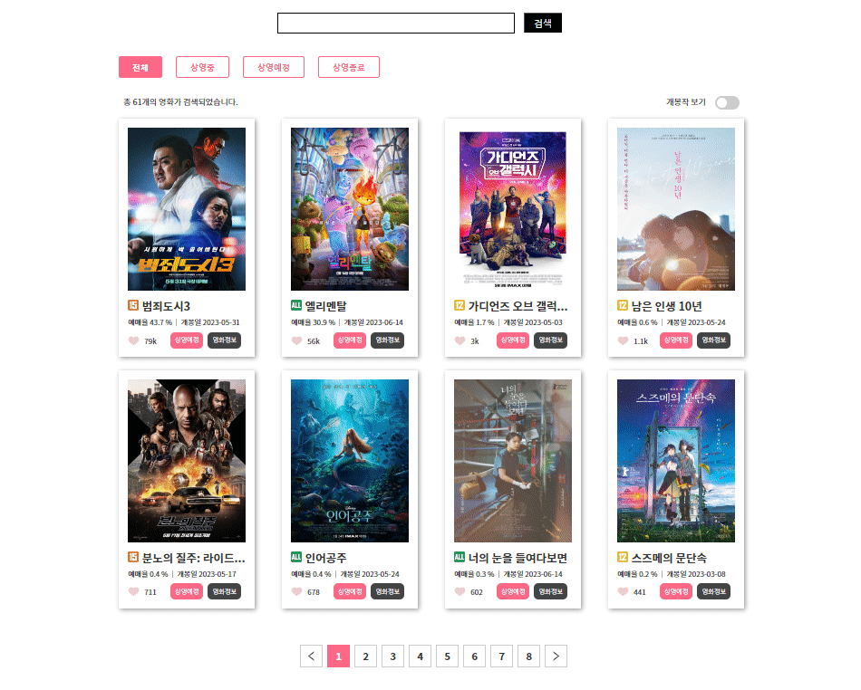

# 영화 사이트 
- 상영예정, 상영중, 상영종료 영화 정보에 대해 알 수 있다.
- 영화 제목 검색을  통해 해당 영화 정보를 볼 수 있다.
---
## 1. 파일 구조
-  Vite ( React JS ) 로 작성
-  styled components 이용
- 파일 구조
  
    
---
## 2. styled components
 - styled components 활용
    -  태그에 className을 작성하지 않고 태그명 자체를 className처럼 작성한다. 
    -  작성한 태그명을 이용하여 태그를 부여하여 css를 적용시킬 수 있다. 
- 작성법 예시
  
  - CinemaItem.jsx 파일
    ```js
    import { CinemaItemBox } from '../styled/CinemaStyle';

    const CinemaItem = () => {
        return (
                <CinemaItemBox>
                        (내용 작성)
                </CinemaItemBox>
        );
    };
    ```
  - CinemaStyle.js 파일
    ```js
    import styled from 'styled-components'

    const CinemaItemBox =  styled.article`(css내용 작성)`
    ```
---
## 3. 화면출력
- 결과물 video
    
    
---
## 4. code 설명
- 영화제목 검색, 영문 작성시 대소문자를 구별하지 않고 검색 가능
    <br>키워드 검색 시 실시간 검색가능, 작성완료 후 enter누르면 값 초기화
    ```js
    const onSearch =(txt)=>{       
        setData(dataList.filter(item=>item.movieNm.toLowerCase().includes(txt.toLowerCase())))
    }

    const onSubmit =(e)=>{
        e.preventDefault()
        onSearch(text)
        setText('')
        setIsplay(!isplay)
    }
    
    useEffect(()=>{
        if(text&&isplay){
            setIsplay(false)
        } 
        if(!isplay){
            onSearch(text)
        }
    },[text])
    ```
- 메뉴버튼 클릭시 '전체, 상영예정, 상영중, 상영종료'에 맞는 데이터 변경
    ```js
    const onMenu=(category)=>{
        if(category === 'all'){
            setData(dataList)
        }else{
            setData(dataList.filter(item=>item.screening === category))
        }
    }
    ```
- [개봉작만 보기 버튼] '상영중, 상영종료'관련 데이터만 출력 
    <br>버튼 재클릭 시, 전체데이터 출력
    ```js
    const onSwitchBtn=()=>{
        if(!switchBtn){
            setData(dataList.filter(item=>item.screening==='now'||item.screening==='past'))
        }else{
            setData(dataList)
        }
    }
    ```
- [좋아요버튼] 하트 클릭 시 데이터 색상 변경 및 숫자 증가
    ```js
    const onLike=(movieCd)=>{
        setData(data.map(item=>item.movieCd===movieCd?{...item, isLike:!item.isLike, audiCnt:item.isLike?item.audiCnt-1:item.audiCnt+1}:item))
    }
    ```
- 한 페이지에 8개의 데이터만 출력
    <br>다음페이지로 넘어가면 이 후의 데이터 출력
    ```js
    const [currentPage, setCurrentPage] = useState(1) // 현재 페이지
    const postsPerpage = 8 //화면출력 게시물수
    const lastPost = currentPage * postsPerpage //화면출력 첫번째 게시물 번호
    const firstPost = lastPost - postsPerpage //화면출력 마지막 게시물 번호
    const pageNumber = Math.ceil( data.length / postsPerpage) // 페이지 총 번호
    const currentPosts = data.slice(firstPost, lastPost) //현재 화면출력 게시물
    ```
- 영화이미지 혹은 영화정보버튼 클릭 시 팝업창띄우기
    ```js
    const onOpen=(movieCd)=>{
        setIsOpen(true)
        setClickData(data.find(item=>item.movieCd===movieCd))
    }
    ```
- axios함수를 사용하여 데이터 가져오기
    <br>데이터 주소 오류시 오류메세지 표시
    ```js
    useEffect(()=>{
        axios.get(url)
            .then(res=>{
                setData(res.data)
                setDataList(res.data)
                setLoading(true)
                setError(null)
            })
            .catch(error=>{
                setData([])
                setDataList([])
                setLoading(false)
                setError(`주소가 올바르지 않습니다.`)
            })
    },[url])
    ```
---
### # 참고사이트
-  메가박스 / 2023.06.21 / https://www.megabox.co.kr/
-  영화관입장권 통합전산망 / 2023.06.21 / https://www.kobis.or.kr/